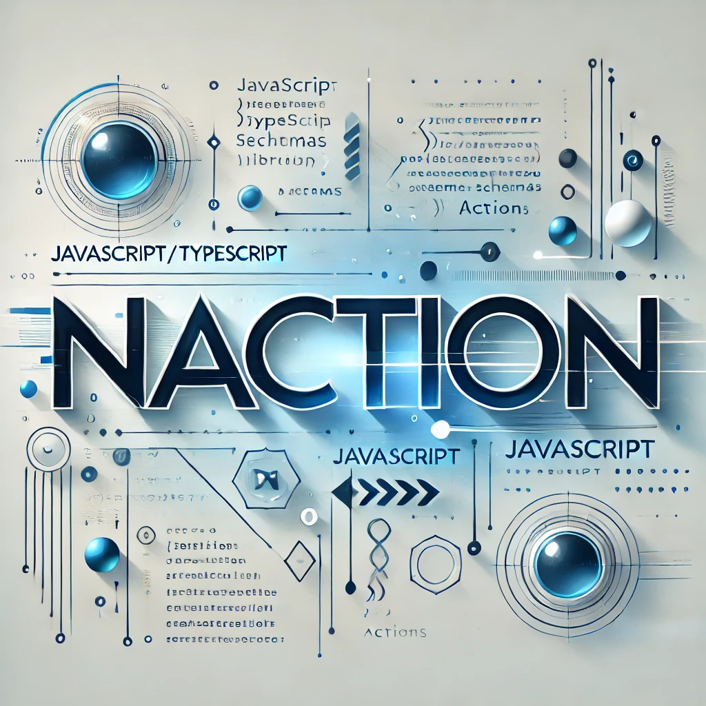

<div align="start" style="display:flex; gap: 1rem">
  
  <div>
  <p>
  <b>naction</b> is a lightweight library for managing server actions and schema-based validation in Next.js projects. It simplifies handling async operations and schema validation with zod, providing a clean and intuitive API.
  </p>
<div>
  <a href="https://npmjs.org/package/naction">
    
  </a>
  <a href="https://npmjs.org/package/naction">
    
  </a>
  <a href="https://packagephobia.now.sh/result?p=naction">
    
  </a>
</div>
  </div>
</div>

## Features

- **Schema-based validation**: Automatically validate input values using Zod schemas.
- **Error handling**: Structured and detailed error messages for validation and runtime errors.
- **Type safety**: Ensures type-safe parameters and return values.
- **Next.js optimized**: Built with Next.js in mind, designed to work seamlessly with its server functions.

## Installation

Install `naction` using npm or yarn:

```bash
npm install naction zod
```

or

```bash
yarn add naction zod
```

## Usage

### `schema`

The `schema` utility allows you to define an action handler with schema validation. The input values are validated against the provided Zod schema before executing the action function.

#### Example

```typescript
import { z } from "zod";
import naction from "naction";

// Define a Zod schema
const userSchema = z.object({
  name: z.string(),
  age: z.number().min(18, "Age must be at least 18"),
});

// Create a schema-based action
const createUser = naction.schema(userSchema).action(async (values) => {
  // Business logic here
  return `User ${values.name} created successfully!`;
});

// Usage
(async () => {
  const result = await createUser({ name: "John", age: 25 });

  if (result.success) {
    console.log(result.data); // Output: "User John created successfully!"
  } else {
    console.error(result.error); // Validation or runtime error message
  }
})();
```

### `action`

The `action` utility is used for simple action handlers that do not require schema validation.

#### Example

```typescript
import naction from "naction";

// Create an action
const fetchData = naction.action(async () => {
  // Simulate a data fetch
  return { id: 1, name: "Sample Data" };
});

// Usage
(async () => {
  const result = await fetchData();

  if (result.success) {
    console.log(result.data); // Output: { id: 1, name: "Sample Data" }
  } else {
    console.error(result.error); // Runtime error message
  }
})();
```

## API Reference

### `schema`

#### `schema<Schema extends z.ZodSchema>(schema: Schema)`

Creates a schema object for defining an action handler with schema validation.

**Parameters:**

- `schema` (ZodSchema): The Zod schema to validate the input values.

**Returns:**
An object with the `action` method.

#### `action<Fn extends (values: z.infer<typeof schema>) => Promise<any>>(fn: Fn)`

Defines an action handler that validates input values against the provided schema and executes the given function.

**Parameters:**

- `fn` (Function): An asynchronous function that processes the validated input values.

**Returns:**
An asynchronous function that accepts input values, validates them, and executes the provided function. It returns a result of type `ActionResult`.

### `action`

#### `action<Fn extends () => Promise<any>>(fn: Fn)`

Creates an action handler without schema validation.

**Parameters:**

- `fn` (Function): An asynchronous function to execute.

**Returns:**
An asynchronous function that executes the provided function. It returns a result of type `ActionResult`.

### Types

#### `ActionResult<Result>`

A union type that represents the result of an action.

```typescript
type ActionResult<Result> =
  | { success: true; data: Result }
  | { success: false; error: string };
```

## Error Handling

- **Validation errors**: If the input values do not match the schema, `naction` returns a detailed error message specifying the invalid fields and their issues.
- **Runtime errors**: Any error thrown during the execution of the action function is caught and returned with an error message.